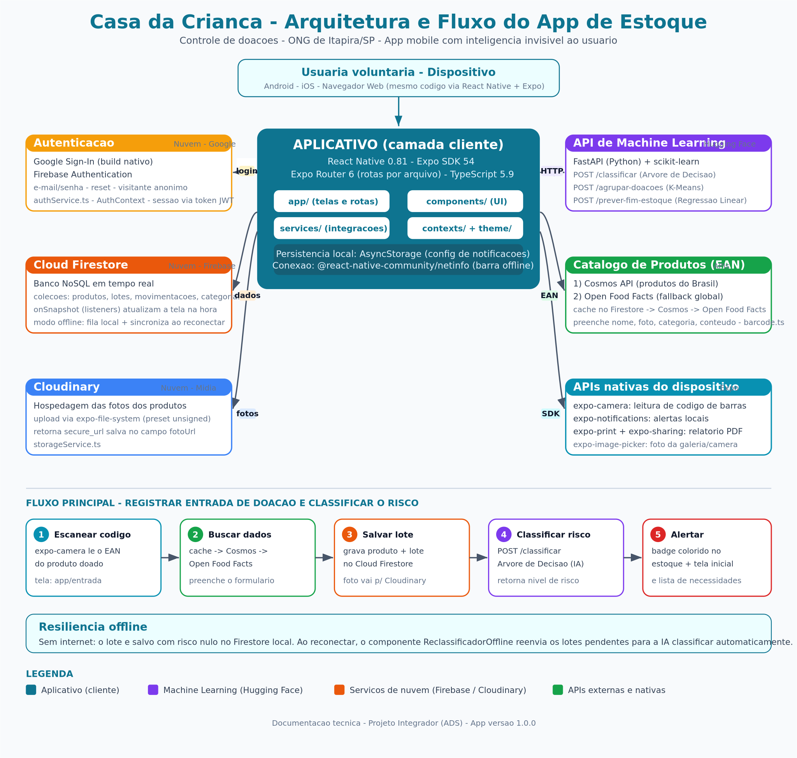

<div align="center">

# 🏠 Casa da Criança — Controle de Estoque

**Aplicativo mobile de gerenciamento de estoque de doações para a ONG Casa da Criança (Itapira/SP)**

Um app pensado para uma voluntária sem conhecimento técnico — toda a inteligência fica invisível na interface.


</div>

---

## 📑 Sumário

1. [Sobre o projeto](#-sobre-o-projeto)
2. [Funcionalidades](#-funcionalidades)
3. [Arquitetura](#-arquitetura)
4. [Instalação e inicialização](#-instalação-e-inicialização)
5. [Variáveis de ambiente](#-variáveis-de-ambiente)
6. [Stack e tecnologias base](#-stack-e-tecnologias-base)
7. [Serviços de nuvem](#-serviços-de-nuvem)
8. [APIs](#-apis)
9. [Algoritmos de Machine Learning](#-algoritmos-de-machine-learning)
10. [Módulos e serviços do app](#-módulos-e-serviços-do-app)
11. [Estrutura de dados (Firestore)](#-estrutura-de-dados-firestore)
12. [Funcionalidades por tela](#-funcionalidades-por-tela)
13. [Compatibilidade e modo offline](#-compatibilidade-e-modo-offline)
14. [Estrutura do projeto](#-estrutura-do-projeto)
15. [Licença](#-licença)

---

## 📌 Sobre o projeto

Projeto Integrador (PI) do curso de **Análise e Desenvolvimento de Sistemas**. O aplicativo digitaliza o controle de estoque de doações da ONG, substituindo o controle manual em papel/planilha por um app que **automatiza o que é complexo**:

```
Doação recebida → Registro de entrada (scanner de código de barras)
               → Classificação automática de risco de validade (IA)
               → Alerta de desperdício na tela inicial
               → Previsão de quando o estoque vai acabar (IA)
               → Lista de necessidades gerada automaticamente
               → Compartilhamento via WhatsApp para doadores
```

> 💡 **Princípio de design:** a usuária nunca vê termos como "árvore de decisão", "cluster" ou "regressão" — apenas alertas coloridos e frases em linguagem natural.

---

## ✨ Funcionalidades

- 📷 **Scanner de código de barras** com preenchimento automático (Cosmos API + Open Food Facts)
- 🚦 **Classificação de risco de validade** por Árvore de Decisão (IA)
- 📉 **Previsão de fim de estoque** por Regressão Linear (IA)
- 🎯 **Sugestão de doações sazonais** por agrupamento K-Means (IA)
- 📴 **Modo offline** com sincronização automática ao reconectar
- 🔔 **Notificações locais** de resumo diário e alerta de estoque zerado
- 📄 **Exportação de relatório** em PDF do histórico de movimentações
- 📲 **Lista de necessidades** pronta para enviar no WhatsApp
- 🔐 **Login** com Google, e-mail/senha ou modo visitante

---

## 🗺️ Arquitetura

<div align="center">



*Arquitetura completa e fluxo "Registrar entrada de doação". O app é o único ponto que o usuário toca; tudo o mais acontece em segundo plano.*

</div>

O sistema tem três blocos que conversam pela internet:

| Bloco | Responsabilidade |
|---|---|
| **Aplicativo (cliente)** | Interface no celular — React Native + Expo |
| **Serviços de nuvem** | Dados (Firestore), fotos (Cloudinary), login (Firebase Auth) e IA (Hugging Face) |
| **APIs externas** | Produtos por código de barras (Cosmos, Open Food Facts) |

---

## 🚀 Instalação e inicialização

### Pré-requisitos

| Ferramenta | Versão mínima | Instalação |
|---|---|---|
| **Node.js** | 18 LTS | https://nodejs.org |
| **npm** | 9+ | Incluído com o Node.js |
| **Expo Go** (celular) | qualquer | App Store / Play Store |

> **Emulador:** para rodar no emulador Android é necessário o Android Studio com um AVD configurado. Para iOS é necessário macOS com Xcode.

### Passo a passo

**1. Clonar o repositório**
```bash
git clone <url-do-repositório>
cd estoque-pi
```

**2. Instalar as dependências**
```bash
npm install
```

**3. Configurar as variáveis de ambiente**

Crie um arquivo `.env.local` na raiz do projeto:
```env
EXPO_PUBLIC_COSMOS_TOKEN=seu_token_cosmos_aqui
```
> O token da Cosmos API é obtido em https://cosmos.bluesoft.com.br. O app funciona sem ele, usando o Open Food Facts como fallback.

**4. Iniciar o servidor de desenvolvimento**
```bash
npm start
# ou equivalente:
npx expo start
```

O terminal exibirá um **QR Code**.

### Abrindo o app no dispositivo

| Plataforma | Como abrir |
|---|---|
| **Android (celular físico)** | Abra o **Expo Go** e escaneie o QR Code |
| **iOS (celular físico)** | Escaneie o QR Code com a câmera nativa — ela abre o Expo Go automaticamente |
| **Emulador Android** | Pressione `a` no terminal após o servidor iniciar |
| **Simulador iOS** | Pressione `i` no terminal (apenas macOS) |
| **Navegador web** | Pressione `w` no terminal |

### Scripts disponíveis

```bash
npm start          # Inicia o servidor (todas as plataformas via QR Code)
npm run android    # Inicia e abre direto no emulador Android
npm run ios        # Inicia e abre direto no simulador iOS (macOS)
npm run web        # Inicia e abre no navegador
```

### Solução de problemas comuns

| Problema | Solução |
|---|---|
| `Unable to find expo` | Rode `npm install` novamente |
| App não conecta ao celular | Certifique-se de que o celular e o computador estão na **mesma rede Wi-Fi** |
| Tela branca no Expo Go | Pressione `r` no terminal para recarregar o bundle |
| Erro de permissão de câmera | Aceite a permissão na primeira vez que usar o scanner |
| API de ML lenta na primeira chamada | O Hugging Face Space hiberna após inatividade — a primeira chamada pode demorar ~10 s para "acordar" |

---

## 🔑 Variáveis de ambiente

Arquivo `.env.local` na raiz do projeto (não commitado no Git):

```env
EXPO_PUBLIC_COSMOS_TOKEN=seu_token_cosmos_aqui
```

As demais configurações ficam diretamente no código (sem segredo real):
- Configuração do Firebase: `services/firebase.ts`
- URL da API de ML: `services/config.ts` (`ML_API_URL`)
- Cloudinary cloud name e preset: `services/storageService.ts`

---

## 🛠️ Stack e tecnologias base

### Framework

| Tecnologia | Versão | Para que serve |
|---|---|---|
| **React Native** | 0.81.5 | Framework para apps mobile nativos com JavaScript/TypeScript |
| **Expo SDK** | 54 | Plataforma sobre o React Native que simplifica build, câmera, notificações, etc. |
| **Expo Router** | 6.0 | Roteamento baseado em arquivos (similar ao Next.js, mas mobile) |
| **TypeScript** | 5.9 | Tipagem estática em todo o projeto |

### Por que Expo e não React Native puro?

O Expo fornece acesso a APIs nativas (câmera, notificações, sistema de arquivos, impressão) sem precisar configurar código nativo (Xcode/Android Studio). Para projetos acadêmicos e protótipos, isso reduz drasticamente o tempo de setup.

### Bibliotecas de UI e navegação

| Biblioteca | Para que serve no app |
|---|---|
| `react-native-safe-area-context` | Garante que o conteúdo não fique atrás da status bar ou da barra de navegação do Android |
| `react-native-reanimated` | Animações fluidas (fade, spring, escala) — cards, badges de risco e telas de sucesso |
| `react-native-screens` | Otimização de performance das telas nativas |

### Persistência local

| Biblioteca | Para que serve no app |
|---|---|
| `@react-native-async-storage/async-storage` | Armazena configurações de notificação localmente (hora do resumo diário, toggles) — funciona sem internet |
| `@react-native-community/netinfo` | Detecta a conexão e mostra a barra de "modo offline" |

---

## ☁️ Serviços de nuvem

Todos em planos gratuitos.

### Firebase (Google) — plano Spark (gratuito)

**Projeto:** `casa-da-crianca-estoque` · **Console:** https://console.firebase.google.com

O Firebase é o backend principal do app. Usamos dois serviços + notificações:

#### Firebase Authentication

**O que faz:** gerencia login/logout (Google, e-mail/senha, recuperação de senha e modo visitante anônimo).

**Como está implementado:**
- A tela de login (`app/login.tsx`) autentica via `signInWithEmailAndPassword`, `signInWithCredential` (Google) ou `signInAnonymously`
- O `AuthContext` (`contexts/AuthContext.tsx`) expõe o usuário atual para todas as telas
- O `AuthGate` (`app/_layout.tsx`) redireciona automaticamente para o login se não houver sessão
- A sessão persiste entre reinicializações via `AsyncStorage` (mobile) ou `localStorage` (web)

#### Cloud Firestore

**O que faz:** banco de dados NoSQL em tempo real, com sincronização automática e suporte offline.

**Como está implementado:**
- Todas as coleções vivem no Firestore (produtos, lotes, movimentações, categorias)
- Os dados são assinados via `onSnapshot` (listeners em tempo real) — qualquer mudança reflete na tela sem recarregar
- O modo offline (`experimentalAutoDetectLongPolling: true`) enfileira operações sem internet e sincroniza ao reconectar
- **Regras de segurança:** apenas usuários autenticados podem ler/escrever

#### Notificações push (locais)

**O que faz:** alertas locais agendados no próprio dispositivo via `expo-notifications`. Não há servidor de push nem token FCM — tudo é processado localmente.

- **Resumo diário:** notificação recorrente agendada para o horário escolhido (`trigger: DAILY`)
- **Alerta imediato:** disparado quando uma baixa zera o estoque de um item (`trigger: null`)
- Configurações (toggle e horário) salvas localmente via `AsyncStorage`

> ⚠️ Não funciona no Expo Go. É necessário um dev build (`npx expo run:android` / `run:ios`) para testar.

### Cloudinary — plano Free

**O que faz:** hospedagem e transformação de imagens na nuvem. **Cloud name:** `dffc6u8z0` · **Upload preset:** `casa-da-crianca` (unsigned).

**Como está implementado:**
```
Usuária escolhe foto (galeria ou câmera)
→ expo-image-picker retorna URI local
→ FileSystem.uploadAsync envia para o Cloudinary
→ Cloudinary retorna URL pública (secure_url)
→ URL salva no campo fotoUrl do produto no Firestore
```
Assim a imagem fica acessível de qualquer dispositivo sem ocupar espaço no Firebase. Código em `services/storageService.ts`.

### Hugging Face Spaces — gratuito

**O que faz:** hospeda a aplicação de Machine Learning (servidor Python com a API de IA).

**URL:** `https://minduim-casadacrianca-validade.hf.space` · **Tecnologia:** FastAPI (Python) + scikit-learn · **Código:** `ml/space/app.py`

- O app faz chamadas HTTP POST aos endpoints a cada classificação, agrupamento ou previsão
- O Space hiberna após inatividade — a primeira chamada pode demorar ~10 s para "acordar"

---

## 🔌 APIs

### Cosmos API (produtos brasileiros)

**Site:** https://cosmos.bluesoft.com.br · **Custo:** gratuito com limite diário · **Auth:** token no header `X-Cosmos-Token`

**O que faz:** banco de dados de produtos brasileiros indexados por código EAN/GTIN. Retorna nome, foto, categoria e quantidade da embalagem.

**Como está implementado:** na tela de **Registrar Entrada**, ao escanear um código, o app consulta a Cosmos primeiro. Se o token não estiver configurado ou o limite diário for excedido (HTTP `429`), cai automaticamente para o Open Food Facts. Lógica em `services/barcode.ts`.

```http
GET https://api.cosmos.bluesoft.com.br/gtins/7891000100103
Headers: X-Cosmos-Token: seu_token_aqui
```

### Open Food Facts

**Site:** https://world.openfoodfacts.org · **Custo:** 100% gratuito, sem autenticação · **Tipo:** API pública e open-source

**O que faz:** banco de dados global colaborativo de produtos alimentícios (mais de 150 países).

**Como está implementado:** funciona como **fallback** da Cosmos. Consulta `https://world.openfoodfacts.org/api/v0/product/{ean}.json`, prioriza o nome em português (`product_name_pt`) e mapeia as categorias para as do app (alimentos, higiene, limpeza).

**Ordem de consulta ao escanear um código de barras:**
```
1. Cache Firestore (gratuito, offline) ──→ encontrou? retorna na hora
2. Cosmos API (produtos BR) ─────────→ encontrou? retorna
3. Open Food Facts (fallback global) ──→ encontrou? retorna
                                          não encontrou? exibe formulário manual
```

### Google Sign-In

**Biblioteca:** `@react-native-google-signin/google-signin` (módulo nativo) · **Custo:** gratuito

**O que faz:** permite entrar com a conta Google, sem criar senha nova.

**Como está implementado:** o token do Google é convertido em credencial do Firebase Auth (`signInWithCredential`). Só funciona em APK/dev build; no Expo Go, o botão exibe um aviso e oferece login por e-mail ou modo visitante.

### Expo Camera / Barcode Scanner

**Biblioteca:** `expo-camera` · **Custo:** gratuito (parte do Expo SDK)

**O que faz:** acessa a câmera nativa e lê códigos de barras (EAN-13, EAN-8, QR Code) em tempo real.

**Como está implementado:** na tela de Registrar Entrada, o botão "Escanear código de barras" abre a câmera; ao detectar um EAN válido, consulta as APIs automaticamente e preenche o formulário.

---

## 🤖 Algoritmos de Machine Learning

Três algoritmos clássicos do **scikit-learn**, rodando na API Python no Hugging Face. **Nenhum modelo roda no celular** — o app envia os dados, a API processa e devolve o resultado. Interface em `services/mlService.ts`.

> **Arquitetura:** só a Árvore de Decisão é treinada uma vez e salva em arquivo. O K-Means e a Regressão Linear são **treinados sob demanda** a cada chamada, com os dados mais recentes — garantindo resultados sempre atualizados sem retreinar e republicar o servidor (ambos treinam em < 100 ms).

### 🚦 Árvore de Decisão — classificação de risco de validade

**Endpoint:** `POST /classificar` · **Modelo:** `ml/space/modelo/classificador.joblib` (carregado uma vez ao iniciar a API)

**O que é:** algoritmo de classificação supervisionada que funciona como um fluxograma de perguntas "sim/não" até chegar a uma resposta. Interpretável e fácil de explicar.

**O que faz:** classifica cada lote de doação em três níveis de risco:

| Classe da IA | Exibido no app | Significado |
|---|---|---|
| `consumo_imediato` | 🔴 Consumo Imediato | O lote pode vencer antes de ser consumido |
| `risco_vencimento` | 🟡 Risco de Vencimento | Monitorar de perto |
| `seguro` | 🟢 Seguro | Validade confortável em relação ao ritmo de consumo |

**Features (entradas):**

| Feature | Descrição |
|---|---|
| `dias_ate_vencer` | Quantos dias faltam para o produto vencer |
| `media_consumo_dias` | Ritmo médio de consumo do produto (calculado pelo histórico de saídas) |
| `quantidade` | Número de unidades no lote |

**Onde é usado:** badge colorido na tela de Estoque, seção "Requer Atenção" na tela inicial e detalhes do produto. A cada entrada ou baixa, o risco dos lotes afetados é recalculado.

**Reclassificação offline:** sem internet, os lotes são salvos com `risco: null`. Ao reconectar, o componente `ReclassificadorOffline` (em `app/_layout.tsx`) detecta os pendentes e os classifica automaticamente.

#### Como foi treinado

1. **Dataset** (`ml/gerar_dataset.py`): como ainda não há histórico real suficiente, foram criados **800 exemplos sintéticos**, rotulados pela razão `dias_ate_vencer ÷ media_consumo_dias` (quantos "ciclos de consumo" cabem antes de vencer). Os exemplos concentram-se nos casos extremos; semente fixa (`seed=42`) garante reprodutibilidade.
2. **Treino** (`ml/treinar_modelo.py`): divisão **80% treino / 20% teste** com `stratify` (mantém a proporção das classes). `DecisionTreeClassifier` com critério **Gini** e **profundidade máxima 5** (evita overfitting e mantém a árvore explicável).
3. **Avaliação:** o script imprime acurácia, relatório por classe (precisão, recall, F1) e matriz de confusão. O modelo é salvo em `.joblib` e enviado ao Hugging Face.

> Por que Árvore de Decisão? É interpretável, funciona bem com poucos dados e variáveis numéricas simples, não exige normalização — e é o algoritmo pedido pelo professor.

### 🎯 K-Means — agrupamento de padrões de doação

**Endpoint:** `POST /agrupar-doacoes` · **Treino:** sob demanda a cada chamada (modelo leve, < 100 ms)

**O que é:** algoritmo de clusterização **não supervisionada** que agrupa dados parecidos sem que ninguém diga de antemão quais são os grupos — ele descobre os padrões sozinho.

**O que faz:** a partir do histórico mensal de doações (unidades de alimentos, higiene e limpeza por mês), agrupa os meses em perfis similares (ex.: meses de campanha de alimentos, meses equilibrados, meses de baixa doação).

**Entrada:**
```json
{
  "historico": [
    { "ano": 2025, "mes": 1, "categoria": "alimentos", "total_unid": 120 },
    { "ano": 2025, "mes": 1, "categoria": "higiene",   "total_unid": 45 }
  ],
  "mes_atual": 5,
  "ano_atual": 2026
}
```
A API normaliza com `StandardScaler` antes do K-Means (obrigatório — as escalas de cada categoria são diferentes).

**Saída:** identifica a qual cluster o mês atual pertence e retorna uma descrição textual, que o app transforma em sugestão em linguagem natural.

**Requisito mínimo:** 6 meses de histórico. Com menos, retorna `suficiente: false` e o app não exibe sugestão.

**Onde é usado:** card azul na Lista de Necessidades (`app/necessidades/index.tsx`) e na seção "💡 Sugestão" da mensagem do WhatsApp. **Nunca** menciona "K-Means" ou "cluster" — aparece como *"Maio tende a ter mais doações de alimentos. Reforce os pedidos de higiene para equilibrar o estoque."*

#### Como foi treinado

Treinado **sob demanda** a cada chamada (não há modelo salvo). O script `ml/treinar_kmeans.py` demonstra o fluxo:
1. Carrega o histórico mensal e o "pivota" para uma linha por mês;
2. Normaliza com `StandardScaler`;
3. **Escolhe o melhor número de grupos (k)** testando de 2 a 6 clusters e comparando **inércia** (método do cotovelo) e **silhouette** (quão bem separados estão os grupos); escolhe o k de maior silhouette;
4. Treina o modelo final e interpreta cada cluster automaticamente.

### 📉 Regressão Linear — previsão de fim de estoque

**Endpoint:** `POST /prever-fim-estoque` · **Treino:** sob demanda a cada chamada

**O que é:** algoritmo que ajusta uma **reta** a um conjunto de pontos. A inclinação da reta indica a velocidade da tendência.

**O que faz:** dado o histórico de saídas de um produto, ajusta uma reta ao consumo acumulado ao longo do tempo e usa a inclinação (taxa de consumo diário) para prever quando o estoque vai zerar.
```
consumo_acumulado ≈ taxa_diária × dias + intercepto
dias_restantes    = estoque_atual ÷ taxa_diária
```
O coeficiente **R²** (0 a 1) mede a qualidade do ajuste.

**Requisito mínimo:** 3 eventos de saída. Com menos, retorna `suficiente: false`.

**Onde é usado:** tela de detalhes do produto (`app/produto/[id].tsx`) exibe "Deve acabar em ~X dias", sempre em linguagem natural.

#### Como foi treinado

Treinada **sob demanda** a cada chamada. O script `ml/treinar_regressao.py` demonstra o método: para cada produto, converte as datas em índices de dia (X) e calcula o consumo acumulado (y); ajusta a reta; o coeficiente angular vira a taxa de consumo. Usar o consumo **acumulado** (em vez de eventos isolados) torna a estimativa mais estável.

### Resumo dos três algoritmos

| Algoritmo | Tipo | Para que serve | Treino |
|---|---|---|---|
| **Árvore de Decisão** | Classificação supervisionada | Risco de validade do lote | Offline, 800 exemplos sintéticos, salvo em `.joblib` |
| **K-Means** | Clusterização não supervisionada | Padrões sazonais de doação | Sob demanda, a cada chamada |
| **Regressão Linear** | Regressão supervisionada | Dias até o estoque zerar | Sob demanda, a cada chamada |

---

## 🧩 Módulos e serviços do app

Todos os serviços ficam em `services/`. Cada arquivo tem responsabilidade única.

| Arquivo | Responsabilidade |
|---|---|
| `firebase.ts` | Inicializa Firebase Auth e Firestore com persistência por plataforma (AsyncStorage no mobile, localStorage no web) |
| `authService.ts` | Login, logout, criação de conta, Google e modo anônimo via Firebase Auth |
| `produtosService.ts` | CRUD de produtos; listeners em tempo real; cálculo de média de consumo |
| `lotesService.ts` | CRUD de lotes; listeners; busca de lotes sem classificação de risco |
| `movimentacoesService.ts` | Registro de entradas/saídas/descartes; cálculo de médias mensais para o K-Means |
| `mlService.ts` | Interface com a API do Hugging Face (classificar, agrupar, prever) |
| `barcode.ts` | Consulta EAN na Cosmos → Open Food Facts com fallback e cache Firestore |
| `storageService.ts` | Upload de fotos para o Cloudinary |
| `notificacoesService.ts` | Permissões, agendamento e disparo de notificações via expo-notifications |
| `risco.ts` | Funções puras: risco por prazo de validade (regra local), código de lote, dias para vencer |
| `categoriasService.ts` | CRUD de categorias personalizadas |
| `seedService.ts` | Gera dados históricos fictícios para testar o K-Means (apenas desenvolvimento) |
| `config.ts` | Centraliza URLs e tokens de APIs externas |

---

## 🗄️ Estrutura de dados (Firestore)

### Coleção `produtos`
```
nome: string · emoji: string · fotoUrl: string | null
categoria: string            ← id da categoria (ex: "alimentos")
ean: string | null           ← código de barras, se escaneado
conteudo: string | null      ← ex: "500g", "1L"
mediaConsumoDias: number     ← ritmo de consumo (calculado automaticamente)
ocultarNecessidades: bool    ← se true, não aparece na Lista de Necessidades
criadoEm: Timestamp
```

### Coleção `lotes`
```
produtoId: string            ← referência ao produto pai
codigo: string               ← ex: "FAR202501"
validade: string             ← formato "YYYY-MM-DD"
quantidade: number           ← saldo atual
quantidadeInicial: number    ← quantidade no momento da entrada
risco: string | null         ← "risco_alto" | "atencao" | "seguro" | null
criadoEm: Timestamp
```

### Coleção `movimentacoes`
```
tipo: string                 ← "entrada" | "saida" | "descarte"
produtoId: string · loteId: string · quantidade: number
data: string                 ← "YYYY-MM-DD"
observacao: string | null · criadoEm: Timestamp
```

### Coleção `categorias`
```
nome: string
palavrasChave: string[]      ← usadas para mapear categorias das APIs externas
ordem: number
```

---

## 📱 Funcionalidades por tela

### Tela Inicial (`app/(tabs)/index.tsx`)
- Saudação dinâmica (bom dia/tarde/noite) com data atual
- **Banner de alerta de desperdício**: verifica lotes com `risco === 'risco_alto'` em tempo real
- **Distribuição de risco**: barra visual proporcional (consumo imediato / atenção / seguro)
- **Seção "Requer Atenção"**: produtos com lotes em risco, expandível por produto
- Footer fixo com acesso rápido a "Registrar Entrada" e "Lista de Necessidades"

### Tela de Estoque (`app/(tabs)/estoque.tsx`)
- Lista completa de produtos com seus lotes
- Badge de risco em cada lote (resultado da Árvore de Decisão)
- Filtro por categoria e busca por nome

### Tela de Produtos (`app/(tabs)/produtos.tsx`)
- Catálogo de produtos cadastrados; acesso ao cadastro e aos detalhes

### Tela de Histórico (`app/(tabs)/historico.tsx`)
- Histórico de movimentações por mês, com filtros por tipo (entradas / saídas / descartes)
- Totais acumulados no cabeçalho
- **Exportar PDF**: gera relatório HTML e converte via `expo-print`, compartilha via `expo-sharing`

### Tela de Configurações (`app/(tabs)/configuracoes.tsx`)
- Alternância de tema (claro / escuro / automático)
- Configuração de notificações (resumo diário, horário, alerta de estoque zerado)
- Gerenciamento de categorias

### Tela de Lista de Necessidades (`app/necessidades/index.tsx`)
- **Seção URGENTE**: produtos zerados + lotes `risco_alto`
- **Seção ATENÇÃO**: lotes `atencao`
- **Sugestão K-Means**: card azul com insight estratégico
- **Botão WhatsApp**: gera a mensagem formatada e abre o WhatsApp
- Opção de ocultar produtos individualmente

### Tela de Registrar Entrada (`app/entrada/index.tsx`)
- Fluxo em 3 passos: buscar produto → definir lote → confirmar
- Scanner de código de barras (Cosmos → Open Food Facts → manual)
- Cadastro rápido de produto novo inline
- Ao salvar: classifica o risco do lote via Árvore de Decisão

### Tela de Registrar Saída (`app/baixa/index.tsx`)
- Fluxo em 3 passos: buscar produto → escolher lote e quantidade → confirmar
- Sugestão de usar o lote mais antigo primeiro (FEFO — *First Expired, First Out*)
- Ao salvar: atualiza a média de consumo e dispara notificação se o lote zerar

### Tela de Cadastro de Produto (`app/cadastro/index.tsx`)
- Formulário completo: nome, categoria, emoji, foto (câmera ou galeria), conteúdo, código de barras
- Upload de foto para o Cloudinary

### Tela de Detalhes do Produto (`app/produto/[id].tsx`)
- Todos os lotes com risco individual
- Previsão de fim de estoque (Regressão Linear)
- Histórico de movimentações do produto
- Ações: registrar entrada, registrar saída, editar produto

---

## 📴 Compatibilidade e modo offline

### Expo Go × Dev Build

| Recurso | Expo Go (teste rápido) | Dev Build / Produção |
|---|---|---|
| Animações (`react-native-reanimated`) | Versão simplificada | Habilitadas |
| Push notifications (`expo-notifications`) | Desabilitadas (stub silencioso) | Habilitadas |
| Login com Google | Desabilitado (mostra aviso) | Habilitado |
| Câmera / Scanner | Funciona | Funciona |
| Firebase / APIs / IA | Funciona | Funciona |

A detecção é feita via `Constants.executionEnvironment === 'storeClient'`; módulos incompatíveis com o Expo Go são carregados com `require()` condicional.

### Modo offline

| Situação | Comportamento |
|---|---|
| Sem internet ao registrar entrada | O Firestore salva localmente e sincroniza ao reconectar |
| Sem internet para classificar risco | Lote salvo com `risco: null`; o `ReclassificadorOffline` processa ao reconectar |
| Sem internet na tela inicial | Dados do cache local do Firestore são exibidos |
| Sem internet para upload de foto | Erro exibido; a usuária pode tentar novamente |
| Conexão perdida | O componente `OfflineBar` exibe aviso via `@react-native-community/netinfo` |

---

## 📁 Estrutura do projeto

```
estoque-pi/
├── app/                  # Telas e rotas (Expo Router)
│   ├── (tabs)/           # Abas: início, estoque, produtos, histórico, configurações
│   ├── entrada/          # Registrar entrada de doação
│   ├── baixa/            # Registrar saída
│   ├── cadastro/         # Cadastro de produto
│   ├── produto/[id].tsx  # Detalhes do produto
│   ├── necessidades/     # Lista de necessidades + WhatsApp
│   ├── categorias/       # Gerenciamento de categorias
│   └── login.tsx         # Autenticação
├── components/           # Componentes de UI reutilizáveis
├── contexts/             # AuthContext (usuário logado)
├── services/             # Integrações (Firebase, APIs, ML, barcode, storage)
├── theme/                # Cores e tipografia
├── ml/                   # Scripts de ML e API Python (FastAPI + scikit-learn)
│   ├── gerar_dataset*.py # Geração dos datasets
│   ├── treinar_*.py      # Treino dos modelos
│   └── space/app.py      # API hospedada no Hugging Face
└── assets/               # Ícones, imagens e diagrama de arquitetura
```

---

## 📄 Licença

Projeto **acadêmico**, desenvolvido como Projeto Integrador do curso de Análise e Desenvolvimento de Sistemas. Sem licença de distribuição formal — uso educacional.

---

<div align="center">

Feito com 💙 para a **Casa da Criança** — Itapira/SP

</div>
